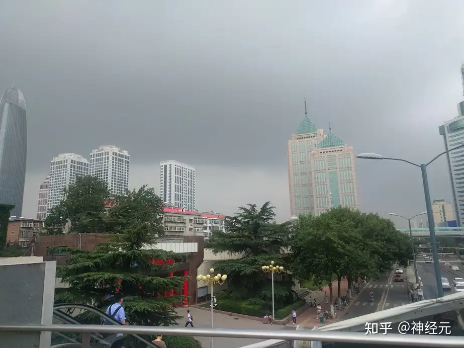
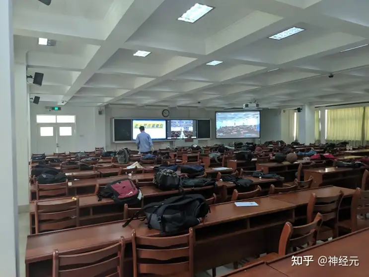

## 序：我的实验

我要用文字重建一座高中,重建我的实验。

——题记

在我的文字中,河水倒流,河底抬升,无数的可能性在过去的未来重新铺开,72年的故事在同一刻发生。致德楼与网球场交映重叠,一号楼上的爬山虎郁郁青青;实验之音的广播声中是操场上奔跑的身影,大红门对面是生生不息的烟火与喧嚣;登攀杯后麦田长青,长廊之下猫声永存;人潮在实中超市中川流不息,金黄的梧桐叶落满报告厅的地板。在这里,楼梯间有管他什么性别的情侣拥吻,正如无数穿着熨烫到没有一丝褶皱的校服拍摄婚纱照的前辈曾经做过的那样;在这里,冬季有五点二十的放学铃声准时响起,正如那延续着千年祥和的济南城缓缓而不可抗的坠入夜色那样。我愿没有人知道什么是高考工厂,我愿所有学子都坚信着自己拥有光明且同样光明的未来;我愿这文字能稍稍抚慰远游孤魂的凄苦,我愿其名为——山东省实验中学。

---

今天偶然在空间看到这么一张图，想来自从毕业以后，也未曾对那渐行渐远的时光留下字句。姑且借来作契，斟上一壶陈酿，在那段记忆被彻底磨损殆尽之前，写下断句残篇一二，以此为念。

先自我介绍一下，2016~2019年就读于山东省实验中学中心校区普通班。

---

## 你为什么选择这个高中

我初中就读于济南育英中学。育英的林南校区与省实验的操场仅一堵矮墙作为分隔，我初三一年都是在省实验的声音中度过的。

省实验的声音是很热闹的：每学期一开学，便会召集全校学生在操场上列队站好，宣读那几页红纸都写不完的表彰决定。排在前面的，是那些世界奥林匹克竞赛拿了或金或银闪闪发光的牌子的，这些人都是要刻上登攀杯留名校史的，就连校长都要亲自拿起实验登攀奖的牌子亲自为他们挂上，而后必定少不了校门口XX银行赞助的教育基金奖学金；再往后的大抵都普通些，像那些甚么国家比赛拿了牌子的，省里比赛有个证书的，乌乌泱泱的在主席台上挤着，拼命踮着脚尖想要在人群中露出个头来——多年以后我便是站在最后一排拼命跳起来想一瞥台下人群的一位。照旧是依次的颁发了实验之星的奖章，咔嚓一张合影，便再次乌乌泱泱的走下台去，绕场一周回到班级，脸上满是得意；最后是些不入流的小奖，大抵是勉励那些不愿与前者同列，却又未来可期的同学的，庄重的宣读完名字后，草草扔下一句请以上同学大课间前往教务处领取证书和奖章便在肃穆的晨露中进入开学典礼的下一个环节。这时候，我的班主任一准会扔掉手中的教学参考不顾，踱步到床边，聚精会神的捕捉着每一个名字，时不时夸耀着“这个学生我是教过的，他当年上初中时就……”

每天中午的时候，林南的下课铃声刚刚打完，隔上一会准会雷打不动的响起《克罗地亚狂想曲》——实验的广播站上班啦。我们便在这熟悉的音乐中或是吃饭，或是继续着笔下的试卷，抢在交卷前的几分钟多写几行公式，或是在答题卡上飞快地涂下一个个黑色方块。随后便会有几个或是和蔼可亲，或是严肃庄重，或是活泼可爱，但都有着标准国音的大哥哥大姐姐播送每天的时事新闻，图书推荐，最后以几首同学们点的歌曲收尾，或是流行，或是古典，间或有几首二刺螈——同学们喜欢什么就放什么，绝不由主任钦点什么励志正能量掺进去。

晚上的时候就更热闹了，大片的夕阳从毫无遮拦的西侧天空泼洒过来，泼洒在足球场的喧闹声上面。操场中间自然是三五十数人踢着足球。情侣们和不是情侣的单身狗们绕着操场，那俩人依偎在一起慢慢踱步，或干脆直接坐在地上的多半是情侣，绕着操场飞快跑步的那是体育生，跑着步但又跑不快的，便是普通学生了。更远一些的地方还有打乒乓球的，打篮球的，打网球的。我们便和他们一起在这金色光辉中结束了一天的学习。什么，你说晚上还有晚自习？开什么玩笑，他们高一高二放学比我们初三都早诶！

育英这边和省实验有关的声音自然也是不少的，毕竟“成功翻墙去对面上学”是每一位育英老师对自己的学生最好的祝福了。至于如此菜如我这样的人，不去省实验又能去哪呢，全市前一百能有机会前往天津南开中学上高中这种好事，我是无福消受了。

## 她的地理位置，周围建筑

美丽的济南市坐落于山东省实验中学之中（什么玩意）。截止我毕业的时候山东省实验中学总共有四个校区，还有两个校区正在建设之中，大有拱卫济南城之势。中心校区大抵在这城市的正中，北面是万达广场，南面是大名鼎鼎的胜利大街小吃街，东面是如长虹一般贯穿了半个济南的顺和高架桥，还有济南育英中学紧紧贴在她的西侧和北侧——仅一墙之隔。

而在这仅仅两三个街区以内，还集中了回民中学、济南中学等数所中学和更多的小学，更不要提后面万达的数座直指云霄的写字楼。这一切培植着蓬勃发展野蛮生产的经济圈。上得厅堂可以在星巴克小酌一杯那个....什么来着？冰红茶！——好的女士一杯冰摇柠檬茶，下得市井也可蹲坐在路边马扎上大快朵颐从我上初中时7毛一串逐渐上涨到1块的麻辣烫。

乍一看上去，大红门后面的省实验大有大隐隐于市，松柏郁青青之感。但这城市中心倒也带来了一点小小的烦恼——主要是对校领导的，学生们倒是不甚以为然：交警队隔三岔五的埋怨放学时间交通就变成了一大滩果酱，先不说那双向三车道的不能承受之痛，单是校门口的拥挤程度便已非北京凌晨七点的地铁可比。父母呼儿声，外卖呼顾客声，汽车喇叭声，还没下晚自习却被吵到的高三倒霉孩子的叫骂声不绝于耳。接下来请欣赏——《省实验放学图》。

## 初见面

要说真正意义上的初次见面嘛，那大概要追溯到我早已毫无印象的幼畜时代了。当时场景大抵是，某位长辈牵着我的手摇摇晃晃地在省实验门口路过。看着大红门突然停下了脚本，思衬了一会后，大抵是觉得我终于有足够的认知能力来理解这是个什么不可名状的概念之后。笃定的告诉我这所学校有多么厉害，正从里面走出来的穿着白白衣服的白白嫩嫩的两足兽也是多么的厉害，并期骥于我将来也能穿上这样白白净净的衣服走进这扇不可名说的门之中去。而我当时大抵是被这肃穆庄严的场景和长辈肃穆庄严的话语吓得仅有的SAN值也掉了个干净，过不了多久就抛诸脑后了。

要说有意义的初见面，大抵是给我发了短信让我去拿录取通知书的那一天。我当时得意洋洋的穿好初中校服，背上书包便拎着手机进去了。进去以后便是排着长长的队，依次凭着准考证号范围找到同一个篮球场上摆着的不同的木头桌子。桌子后面温柔大姐姐微笑着——大抵是面无表情或者霸气侧漏A到爆也说不定，毕竟我也早就忘了那天的场景了，但思来想去还是用传统叙事笔法更好一些——看了一眼我的准考证号，然后翻找到了我的录取通知书，递给我——“下一位！”

什么嘛！刚才我来的时候路边某民办国际学校的传单都比这好看吧啊喂！！

## 讲一下你的班主任吧

我的班主任是一位身长五尺半的物理老师，虽然未曾见过她讲磁场之时如王几何一般背手画正圆，亦未曾得见此人一语道破高考压轴题的真谛，使得那班里最愚笨的同学也得以窥见真实。但她确实是一位好老师。我记着她一黑板又一黑板的不厌疲倦的书写着解答步骤，也记着她温柔耐心地对待每一位去办公室找她的同学，无论是问题还是考砸了亦或只是想逃学来开请假条。我现在对她最深的印象是，高三有一次班会课上，她一本正经的和我们说，不要害怕迟到了给班里扣分就不来上学，年级评比奖金什么的她全都不要了，只希望我们能在这一年里好好学习。

## 你最好的同学

我要写的这人，是我们班的化学课代表。此人大概确实是个女孩子吧。她常年一头短发，加上几乎没有任何性别特征，以至于隔壁班化学课代表都曾找我打听此人的性别。由于此人是化学课代表的缘故，加之身上遮盖不住的反社会性别刻板印象气质，我很快就被她吸引了。而她人又十分直率热情，极其容易相处，所以被我单方面认定为是我高中最好的朋友了。我现在记忆中关于她最清晰的一件事是，我俩在实验室忙了一下午以后，一起出去吃晚饭，她带我去了学校对面的一家小面馆并向我大力推荐，我们面对面坐着吃完了各自桌上的面。高三运动会的时候，我俩一半凑巧加上一半我设计，挨到了一起坐着。刚开始的时候我还能精神抖擞的拉着她聊天，后来到了八九点钟，太阳一照便开始头晕，遂干脆趴此人肩膀上睡了起码一个小时，而此人更是极为敬业的一动不动的cos着一个抱枕。以至于她中午向我埋怨自己肩膀疼的时候，我真心为我的体重内疚了好久。我睡觉期间体委还试图起哄，大声嚷嚷着XXX你为什么让他睡你身上，但是只回头看了一眼便识趣的回过头去安心玩自己的手机了。最为神奇的是，此人高一高二常年班里四十多名，高三却突然只用一个月就跑进了班级前十，在我请教的时候告诉我高三认真学一个月就行，最后还真考上了山大。虽说对我高三几乎毫无帮助——原因大概是我高三连一个月也没咋努力，但是确实给我的高五生活增添了很多信心，而且最后也像她一样莫名其妙地考上了一个末流985（虽然我一直认定是，新高考变得简单了不少的缘故）。

## 最喜欢上谁的课&最喜欢学校的哪个地方&最怀念的地方

若是不限定考试科目的话，那自然是校本课，而校本课我又每次都能被内定一样的选到石老师的机器人课。平时自习课我都有的是理由跑到创新室划水摸鱼，等到了正经上课那就更是如鱼得水——玩手机和电脑玩得不亦乐乎。虽然比赛任务没完成的时候会被抓去做苦力，但是机器人比赛嘛，就算干苦力，和班里做卷子的其他同学相比也是逍遥的赛神仙，接个线啦，手提角磨机大刀阔斧啦，还有我最常干的对着Android Studio发呆什么的，不也和玩差不多的嘛。

要说不好玩的时候，那也是有的。比如有一次石老师跑去隔壁教室招待家长去了，我们正或吃着泡面，或躺桌子上睡午觉，或两三个未带电脑的人围着带电脑的人打彩虹六号的时候。突然推门进入两个黑衣黑裤的穿西装的瘦高人，后面跟着一个未穿西装的矮瘦的未穿西装的人。我们只当是又来了几位闲杂家长，斜斜的瞥了一眼便继续各干各的，啥都不干的继续躺着睡觉。可见开路那二人，为首的那位手持着笏牌，啊不是，手持着工作证，高唱到“校长驾到，见者退避！”接着便是石老师慌张的从隔壁教室跑出来，说着什么…“学生不识”…什么…“恕罪”…一类的话。我们也变了神色，连忙从桌子上跳下，立定站好，不敢多说一句话。隔了一周，学校广播突然说什么，请全校竞赛学生前往礼堂开会，当天便有数学、物理、化学、生物、信息、地理六大派的门生相互指责，传言说是那天主任在礼堂大发雷霆，斥责竞赛学生在实验室吃喝玩乐睡觉打游戏，无恶不做，大伤风化，饬令本周内整顿。而六大派却各自的摸不着头脑，谁都未曾有胆在各自的竞赛教室干如此离谱之事，只得互相指责猜疑，大有实验版黑暗森林之感。我们虽偷乐着天上掉下来了六群替罪羊，此后却也不得不收敛了许多。

多年以后，当已经上了高三的神经元面对政治书上高一的自己的时候，他准会回想起石老师带他见识创新室的那个午后。

## 一次躲跑操的经历

上了高三之后，由于和某位主任混了个脸熟（，再加上成绩实在不咋地），于是获得了一个只要不影响学校秩序，有利于我学习，就可以为所欲为的特权。起初自然只是以此为借口逃个升旗跑操什么的，在班里写作业自然算是学习，趴桌子上睡觉就是为了上课的时候不犯困，自然也算是学习，总之就是一切都是为了学习所以我啥活动也不想去。但是一天天的趴在桌子上多无聊，于是有一天我趁集合时人慌马乱，悄悄地坐着电梯直达天台，饶有兴趣的观赏起了操场上跑操的众生。

## 运动会

我看了四年的实验运动会。虽说第一年是趴在林南的初三教室里面看的，但是观赏效果却是四年以来最好的一次。省实验的运动会是非常简朴的，一个操场，周围一圈学生或席地而坐或搬来桌椅。便是一场运动会了。而初三时的我们，是得以站在三楼教室里俯瞰整个操场的。

省实验的运动会总是在国庆放假的前一天，虽说此时多半已经立秋，但是济南的秋天却总是格外的给面子，不说滴雨不见，就连太阳都分外的灿烂。学生们一清早就到了操场，或许有六点，又或许只是七点——我记不太清了，入场式和观众时间不同也说不定。接着便窸窸窣窣的一人搬了一条椅子，向操场挪去。操场紧靠着育英的那面墙下有一排树，而我却从未曾知晓那些树的科属；其他三面是没有树的。有树的一面是要留给高三的，没有树的三面是要让高一高二的依次排开的。我坐在没有树的地方的时候，必须要脱下校服外套，整个的盖在头上，才能坚持到中午放学而不致汗流浃背；只有在我最后一年到了树下面，才得以趴在她的校服上换得一个甜美的梦。

开运动会的前一天，老师们大抵都会照本宣科的传达一下学校的会议精神，提一嘴禁止带零食和手机之类的；偶尔也会有年老而慈祥的老教师，深知那会议精神本是靠不住的——又会有谁真的不带呢？自然的，不管前一天会议精神如何传达，第二天总是少不了睡眼惺忪的学子扛着板凳，背着鼓鼓囊囊的书包，七歪八倒的在操场上坐成一片，或分享零食，或独自听歌，或干脆围成一圈打打排位，自然也会有借着大好秋光安静看书的人——偷得浮生半日闲，唯独少了那写作业的人，毕竟就算是高三，又有谁会在放满七天假的国庆节前一天的运动会上写作业呢。

忽然一人大呼：“主任来了”，俄而班长大呼，班主任大呼。一时间所有人都在手忙脚乱地把手里的东西往包里面塞，然后赶忙整理衣襟正襟危坐。霎时便见那一队或西装或长衫的人在塑胶跑道上向我们走来，彷佛视察一片片桃树园和李树园的农民一般，脸上挂着沉甸甸的喜悦，不住的挥手问候。

实验的运动会，是很混乱的。毕竟三个年级两个性别数不清十几个项目要在一天一个场地上比完。常常是东边的喇叭叫着高一男子100m短跑去西边检录，西边体育部长高喊着高三女子铅球获奖运动员抓紧去东边准备领奖。我们也就在这混乱之时为混乱喝彩，在混乱之中庆贺混乱。谁什么时候跑了什么项目拿了第几并不重要，只要注意到有同学浑身湿透的回来，就必定会一拥而上的用饮料水果巧克力为之加冕。

要说最为精彩的，还是每年最后的保留节目——教师运动会。到了这个时候，所有人都弃凳子不顾，簇拥到跑到两旁，在欢声笑语中迎接运动会的尾声。此时的教师们，个个都准备好了若是胜利便能让自己的学生将名字呐喊，若是出了一点差错就会被无数镜头拍下来做成表情包霸占实验学子一整天的空间的觉悟。或是激流勇进，或是稳中求胜，抑或明知不敌...那就不敌了吧。毕竟，最后结果如何，现在又有谁记着呢？

## 最奇葩的作业/试卷题目

A，B，C，D四种物质，A，B可以相互转化，B在沸水中加热可以变成C，C久置于空气中会生成D，且D具有臭鸡蛋气味。请问A，B，C，D分别是什么？

A：鸡，B：生鸡蛋，C：熟鸡蛋，D：臭鸡蛋

## 一次糟糕的天气

2018年4月21日，经七路变成了经七河。

图书馆顶楼的天文台被雨水镀上了一轮钛白色的光圈。

## 午休经常干什么

之前已经介绍过了省实验周围繁茂的饮食文化，在这里再说一点别的。

众所周知，在2016年10月以前，山东省实验中学本校区是没有午休的。在十二点到两点期间，校门大开，来去自由。图书馆里可以看书，班里可以趴桌子上睡大觉，体育管里可以运动，饿了的同学还可以去操场上吃狗粮和柠檬，单单是躺着草地上，举起手掌透过指缝看天上的云朵飘来飘去，漫不经心的听实验之声午间广播里的每日新闻，也是一种极好地享受，实验学子的生活丰富多彩。而彼时刚入学的我们甚至不满足于此，我们曾骑着电动车去泉城广场喂鸽子，曾打上出租车去泉城公园的湖中划船，也曾坐着公交车远赴市图书馆寻一本书看。

奈何好景不长，国庆节刚回来的第一个升旗仪式上，校长就以居民区投诉为由宣布山东省实验中学本校区正式开始实施午休制度。自那以后，我们的乐趣便少了许多，大部分时间无非是躲着检查的同学，在校园里遛弯罢了。

## 隔壁班的帅气小哥哥

单推这位高二高三连续为我们争取了两年的元旦联欢会，即使是要因此生吞卷子也在所不辞。

## 一段不为人知的故事

怂恿一个学弟把一块钠扔进学校池塘了（据学长说那个池塘隔两年就要遭受一次此类无妄之灾）

<video controls>
  <source src="13.mp4" width="100%" type="video/mp4">
Your browser does not support the video tag.
</video>

## 会想主动和别人分享的故事

虽然已经毕业很久很久了但是今年看到的时候还是非常震惊于省实验的象牙塔氛围。再让我回去读上四年高三我都愿意真的我看到这个我都哭了这才应该是一个高中应该有的样子啊。

## 从来没去过的地方

一号教学楼的二楼以上。那里原来是给高三学生的教室，但是在我高三那年，学校的五号教学楼盖好了，于是一号教学楼和三号教学楼也就逐渐废弃搁置了，我至今也仍不知道那上面是什么样子。

## 别开生面的学校活动

又一个上大学还不如回省实验上高三的例子。

## 军训

我现在对军训唯一的记忆，就只剩下我一个人安静的坐在树荫下看《唐诗鉴赏辞典》了，树上是盛夏的蝉鸣。

## 一个很有趣的同学

说一些有趣的往事罢

高考完了之后回学校帮忙监考今年的体育特长生招生考试，然后不约而同的开始给初三小朋友整活

<figure>
  
  <figcaption>《老大哥在看着你》</figcaption>
</figure>

## 校园传说

大概是在我刚上高一的时候，有一天升旗仪式校领导通报批评了几位学长，说他们破坏学校公物，擅闯学校仓库……传说，校长建校之时，曾言道：“此世群魔诸神并起，我虽无意逐鹿，却知学子苦楚，只愿荡涤四方，护得浮世一隅。”总而言之，翻译过来就是实验是有龙脉的，而且在那谁也不知道走向的龙脉的龙眼之处，有一扇毫不起眼的小门，门里面埋藏着历任校长的看守并不断积蓄至今的宝藏，这宝藏有着重振素质教育风雅，帮助每一位实验学子实现人生理想的精神力量。终于有一天，衡水外患和XX二中内敌步步紧逼，三位勇者再也按捺不住，踏上了属于他们的救亡图存之路。他们把直尺改装成寻龙尺，他们贿赂了执勤的学生会同学，他们引开了看守大门的饿狗，他们一刀劈断了锈迹斑斑的铁索，在身后政教主任急促逼近的脚步声中毅然决然的闯进了这十数年无人踏足的禁地，却只见对面的墙上乌黑似血苍劲有力的八个大字——“博学日新，德行天下”。

## 高考前一周&毕业典礼

高考前的很长一段时间，我都是在家里闭门造车。当时心想着，反正高一高二都学过一遍了，复习不复习也无所谓嘛。倒是这个Android Studio，花花绿绿的，看起来好玩的很，赶紧多玩一玩，就这样一直玩到了高考前两周才停手。

说来也巧，我这敝帚本来打算自珍的，结果拿到哈工大自招面试一通忽悠，忽悠的对面给了我97.33分。没记错的话当年所有人应该只有两个99.33分的人排在我前面，下一个就是我了。大概也算是一种弄拙成巧。

就是可惜了哈工大，本来按惯例是我只要过了一本线他们就能把我们几个捞过去，可谁知道19年教育部突然一纸通告说自主招生最多降分20，弄得哈工大傻了眼，到手的学生也插翅膀跑了。

我们的毕业典礼，在2019年6月那个不能说的星期二早上准时举行。其实和开学典礼也没啥差，无非就是升旗，学生代表讲话，学生代表诗朗诵，教师代表讲话，家长代表讲话，主任讲话，校长讲话。待到除了物业之外所有能被代表的和不能被代表的都被代表了一通之后，就轮到高一和高二的小朋友们目送我们离开了——不过是离开回班里接着上课，正式离校就要等到第二天6月5号了。

离校那天我还意图和上文提到的那位化学课代表聊聊天，毕竟这一别就真的是“此去经年了……”，奈何此人一放学就肩扛着打扫卫生的重任，躲到女厕所水池里精心打理马上就要不知道到谁手里的那几盆多肉或是少肉的植物去了。我干站着也不像怎么回事，只好帮忙也干干值日，这一干就干到了班里连着班主任就只剩下三个人的地步才见她抱着大大小小的花盆回来。这时的我惊觉自己还忘了搞什么，校服签名活动，赶忙东奔西跑的要了几个签名才离开。事后，班主任还夸我爱班级有责任心自愿打扫卫生到最后走。嗯，这么误会着好像也不错。

2019年我并不是在实验高考，但是，我相信这张照片会深深刻在几代实验人的高考的意象之中。

## 如果回到高中开学的前一天，你会对当初的自己说什么

我可能有很多话想要说，但事实上我什么都不敢说。我想，还是就让我自己慢慢的沿着这条注定的轨迹继续走下去吧。

## 学校的义卖

---

素材声明：由于许多素材年代过于久远，无法追溯到原作者，或原作者署名为真实姓名，故有部分素材未标明出处，还请看到的同学联系我妥善处理署名问题，希望各位校友多多包容，谢谢。

本文原写于知乎：<https://www.zhihu.com/question/27637778/answer/2256679597>
