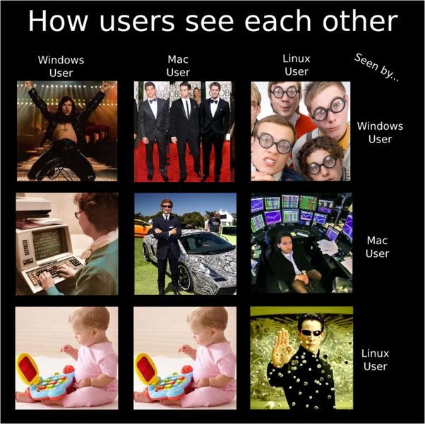

使用Windows你只会拥有几米长的Steam库存，和大学室友通宵打游戏，度过一个充实快乐有很多朋友的大学生活；使用Linux，你只会拥有一邮箱的bug track和pr review，在 git bitsect 中度过一个又一个脱发猝死的夜晚，被路过的同学看到终端感叹一句，又有个装逼的黑客小子。

使用Windows，你可以随意购买一个开箱即用的笔记本，拥有最炫酷最喜欢的外观，让无数迷妹围绕着你尖叫；使用Linux，你只会在不知不觉中给厂商贡献一大堆逆向手写的驱动程序和配置文件，还会被厂商鄙夷的回复“建议使用Windows操作系统，遇到任何问题请运行一键恢复软件。”买电脑只能买ThinkPad，旁人路过都会惊讶：“这个电脑好像我爷爷上学的时候用过的”

过年回村里媒婆给你介绍相亲，媒婆说对方家里有两套房两辆车可以给50万彩礼，你问对面GitHub上多少star，PGP给一下我先计算一下我们之间的信任度。亲戚来拜年，说他家孩子今年水了多少篇石墨烯掺杂的最新最热材料学论文，在外面做生意开了几家店；你父母在你服务器暴力扇震耳欲聋的响声中大声喊，我孩子今年在家里组了40G局域网，又捡了两台epyc构建缓存，屋里不用烧炉子都暖和，家里的电表也越转越快了，他刚才说年夜饭他先不吃了又kernel panic了。

毕业的时候你用LaTeX和Typora赶在ddl前写好了论文，老师说同学请你提交word版本pdf不行的喔你这个tex是什么我们电脑上打不开。

