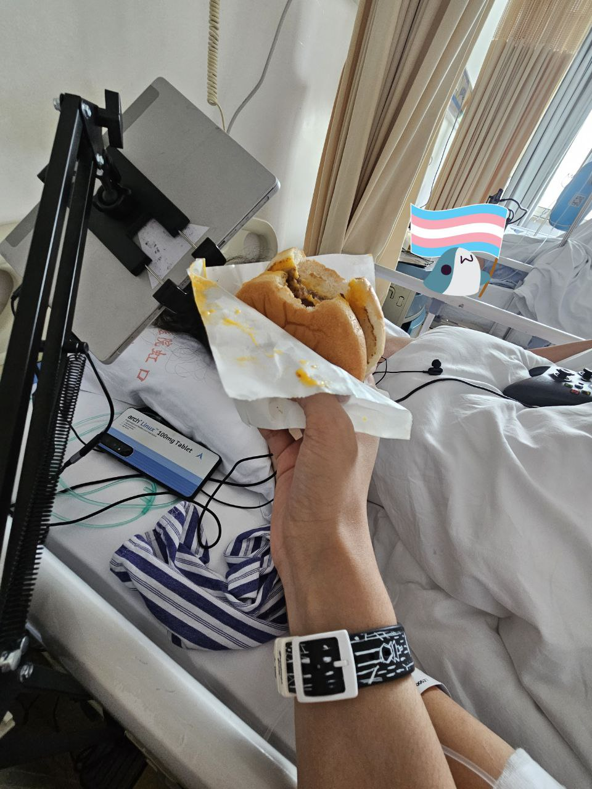

自2023年后我就再也没有吃过麦当劳的不速之霸了。

我对其的印象永远地停留在了东江湾路床边那个带着山前的温度的皱皱巴巴的麦当劳袋子。后来，那成了我在禁食结束后吃到的第一口食物，冰冷，干涩，久置后凝固的油脂和失水的面包片难吃到几乎无法下咽，但我还是吃了。

直至今日，我仍不敢再去买一个新鲜出炉的不速之霸，也很久没有再见到山前了。我担心ta一如既往的像记忆中一样腻涩，又惶恐ta再也没有记忆中一样令人欣喜激动。

休对故人思故国，且将新火试新茶，诗酒趁年华。

