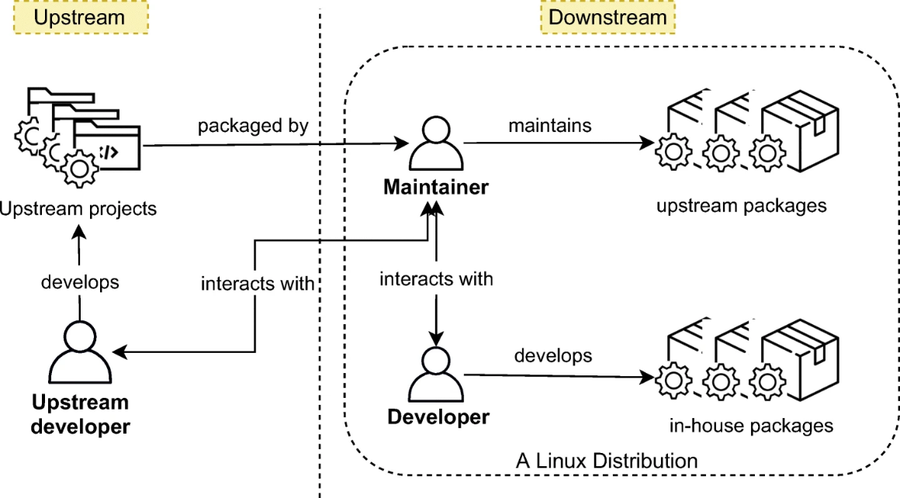
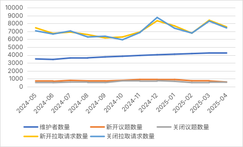
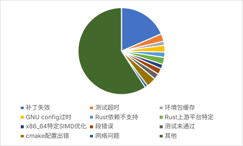

## 摘要

随着Linux 社区的蓬勃发展，Linux 发行版的维护工作也愈加繁重。在Linux 发行版的软件打包过程中，构建错误时有发生。这些构建错误会阻塞软件的更新，影响用户体验。如何快速准确地修复构建错误，提高软件的发布效率，是Linux 发行版维护工作中的重要问题。本文回顾了相关领域的背景技术发展现状，简要介绍了目前Linux 发行版维护相关的背景知识，着重分析了目前数个高热度Linux 发行版社区的构建系统以及维护情况。基于上述数据，本文设计了一套█​█​█​█​█​█​█​█​█​█​█​█​█​█​█​█​█​█​█​█​█​█​█​█​█​█​█​█​█​█​█​█​█​█​█​█​█​█​█​█​█​█​█​█​█​█​█​█​█​█​█​█​█​█​█​█​█​█​█​█​█​█​█​█​█​█​█​█​█​█​█​█​█​█​█​█​█​█​█​█​█​█​█​█​█​█​█​█​█​█​█​█​█​█​，并使用实际生产环境中的数据测试了这套系统的效果。我们希望这一套系统能够有效的探索开源软件社区的智能化维护，提高社区的工作效率。

**关键词**：AI 修复；构建错误；大语言模型；自动化工作流；智能运维

## 第一章 绪论

### 1.1 项目背景与意义

大多数开源软件（OSS, Open Source Software）项目都是作为大型软件生态系统（例如 Linux 发行版）的一部分发布的。此类发行版以软件包的形式发布开源项目，其他开发人员可以在其基础上进行构建。流行的 Linux 发行版（例如 Arch Linux 和 Debian）由数千个相互依赖的软件包组成，从而形成了软件供应链[^1]。为了实现这一点，发行版的维护者使用发行版的包管理器以标准格式打包所有项目，并记录任何元数据，例如依赖项、许可证等。软件包管理器能够为终端用户强制执行元数据，保证每个已安装的包都具有它需要的所有依赖项[^2]。

随着开源生态系统的蓬勃发展，Linux 操作系统已成为现代数字基础设施的核心组件开源和生态成为软件研发模式的主流：在超级计算机市场，100% 采用开源；80% 的企业级操作系统是Linux；75.44% 的智能手机操作系统是 Android；在云计算领域，90% 的公有云负载运行在开源软件之上。而微软也坦陈，在Azure 云上，60% 的工作负载都运行在开源的 Linux 之上[^3]。

这种技术主导地位使得Linux 发行版的软件质量直接影响着全球数字服务的可靠性和安全性。在持续集成/持续交付（CI/CD）范式主导软件开发的今天，Linux 发行版的软件包构建过程面临着前所未有的挑战：软件源更新频次日渐增高，依赖关系复杂度呈指数级增长，跨架构兼容性要求持续提升。在这种背景下，构建错误已成为Linux 发行版维护工作中的重要问题。

在软件包构建实践中，构建错误已成为阻碍软件交付效率的关键瓶颈。此类问题不仅延缓了安全补丁的及时部署，还可能导致依赖链断裂等系统性风险。传统上，构建错误的诊断与修复高度依赖维护者的经验积累，需要人工解析构建日志、回溯依赖关系、验证补丁有效性。然而，随着软件包数量突破十万量级（如Nixpkgs），维护者与软件包数量的比例失衡问题日益凸显。

软件包的构建错误包含有构建过程的日志，其中通常包含着构建失败的原因提示。然而，构建日志的信息量庞大，且通常缺乏结构化，使得借助简单的文本搜索和文本匹配等技术的简单分析程序往往无法有效的运行。因此，借助自然语言处理技术对日志进行分析，提取构建错误的关键信息，对错误归类聚合，有望提高构建错误的诊断效率，也能够加深我们对超大规模软件生态错误修复的洞察能力。

█​█​█​█​█​█​█​█​█​█​█​█​█​█​█​█​█​█​█​█​█​█​█​█​█​█​█​█​█​█​█​█​█​█​█​█​█​█​█​█​█​█​█​█​█​█​█​█​█​█​█​█​█​█​█​█​█​█​█​█​█​█​█​█​█​█​█​█​█​█​█​█​█​█​█​█​█​█​█​█​█​█​█​█​█​█​█​█​█​█​█​█​█​█​█​█​█​█​█​█​█​█​█​█​█​█​█​█​█​█​█​█​█​█​█​█​█​█​█​█​█​█​█​█​█​█​█​█​█​█​█​█​█​█​█​█​█​█​█​█​█​█​█​█​█​█​█​█​█​█​█​█​█​█​█​█​█​█​█​█​█​█​█​█​█​█​█​█​█​█​█​█​█​█​█​█​█​█​█​█​█​█​█​█​█​█​█​█​█​█​█​█​█​█​█​█​█​█​█​█​█​█​█​█​█​█​█​█​█​█​

本设计的意义如下：

1. 软件包的及时更新对用户至关重要 \
  Linux用户他们通常非常重视保持他们使用的软件包的最新版本，主要是出于安全考虑，但也主要是为了从错误修复和新功能中受益。只要有可能，用户就喜欢通过发行版的官方包管理器，使用发行版的官方存储库来更新软件包[^6]。
2. █​█​█​█​█​█​█​█​█​█​█​█​█​的关键应用领域 \
  █​█​█​█​█​█​█​█​█​█​█​█​█​█​█​█​█​█​█​█​█​█​█​█​█​█​█​█​█​█​█​█​█​█​█​█​█​█​█​█​█​█​█​█​█​█​█​█​█​█​█​█​█​█​█​█​█​█​█​█​█​█​█​█​█​█​█​█​█​█​█​█​█​█​█​█​█​█​█​█​█​█​█​█​█​█​█​█​█​█​█​█​█​█​█​█​█​█​█​█​█​█​█​█​█​█​█​█​
3. 降低发行版维护者的人力消耗 \
  作为上游项目和最终用户之间的中间人，发行版维护者花费了大量的精力和资源来维护上游包，例如，更新到新版本、应用和报告错误修复等[^2]。在传统的发行版维护工作中，这些工作需要富有经验的软件包维护者人工确认并给出修复方案，会消耗维护者的大量时间和精力。我们可以期望，这项工作能够帮助维护者降低修复工作需要的工作量，增加其工作效率。

### 1.2 国内外研究现状

<div align="center">
[数据删除]
</div>

### 1.3 主要研究内容

本项目是基于人工智能技术的Linux发行版构建错误智能修复流程设计，意在改善现有Linux发行版的维护实践。

项目使用人工智能技术介入Linux发行版的修复工作流程，相较于传统的人工修复方式，有望提高修复效率，简化维护者的人力劳动，缩短发行版的错误响应时间。设计内容主要包括：构建错误日志和维护历史的自动化获取、日志文件的智能文本分析和信息提取、█​█​█​█​█​█​█​█​█​█​█​█​等。

本项目使用的技术目前已经趋近于成熟稳定，█​█​█​█​█​已经被业界广泛运用于代码生成工作的工程实践中。目前的Linux发行版维护工作中鲜有使用█​█​█​█​█​的尝试，本项目具有较高的前瞻性与探索性。

### 1.4 论文组织结构

**第一章 绪论** 介绍了项目的背景与研究意义，国内外的研究现状，以及论文的组织结构。

**第二章 相关理论与技术介绍** 介绍了本设计所涉及的背景知识，主要涉及Linux发行版的维护工作以及设计过程中涉及到的程序算法。

**第三章 维护历史数据的收集与分析** 分析了Linux发行版社区的互动以及维护历史，设计了一套聚类构建错误类型的系统，最终得出常见的错误类型及其分布。

**第四章 基于█​█​█​█​█的错误修复** █​█​█​█​█​█​█​█​█​█​█​█​█​█​█​█​█​█​█​█​█​█​█​█​█​█​█​█​█​█​█​█​█​█​█​█​█​█​█​█​█​█​█​█​█​█​█​█​█​█​█​█​█​█​█​█​█​█​█​█​█​█​█​█​█​█​█​█​█​█​

**第五章 总结与展望** 对全文的内容进行回顾与总结，并提出未来可能做出的改善和进行的工作。

## 第二章 相关理论与技术介绍

在这一章中，我们将简要介绍本设计所涉及的相关理论与技术知识。我们将介绍Linux发行版种维护者的角色与职责、软件包的构建过程，以及本设计中使用的词频-逆文档频率算法以及DBSCAN聚类算法的基本原理。

### 2.1 发行版软件包管理

Linux 发行版包含内核、一组软件包和一个软件包管理系统。软件包管理器通过在特定存储库中搜索可用软件包来简化从头开始安装软件，同时确保遵循指定的版本约束[^2]。
在Linux发行版社区中存在着三个角色：上游开发者、维护者、终端用户。

<figure>
    <div style="text-align: center;">
        
    </div>
    <figcaption>图 1 Linux 发行版中维护上游软件包所涉及的三个主要角色</figcaption>
</figure>

上游开发者是负责开发上游项目的成员，他们开发各类运行库（例如著名的加密通信库OpenSSL）和应用软件（例如受欢迎的图像编辑程序GIMP），上游项目通常是独立于发行版甚至操作系统的，他们只将源码发布在代码托管平台等网络服务器上。

维护者是一个发行版的维护工作中最重要的角色，他们负责针对自身发行版的构建系统、工具链和包管理器，编写各类上游项目的构建脚本，并将构建脚本或构建完成的文件分发给终端用户。维护者需要负责解决发行版内的软件包依赖问题，确保所有的软件包都可以正常稳定的运行在系统上。软件包维护者通常还会接收和处理来自终端用户的错误报告，这些错误有些时候是由维护者的打包脚本内的错误引起的，有些时候是由上游项目中的错误引起的。维护者一般需要向上游报告那些上游项目中的错误，在某些必要的情况下还需要帮助上游开发者修复上游项目中的错误。

终端用户在选择一个自己喜爱或者需要的发行版后，将其安装在自己的设备上。通常来说，在Linux发行版中，用户不需要自行从上游项目的网络服务器上下载源代码，自行安装上游项目需要的依赖，并自行编译和安装；而是在发行版的软件包管理器中直接搜索和安装上游项目，由软件包管理器根据维护者编写的元数据自动下载依赖项，并根据维护者编写的构建脚本自动构建和安装，或直接安装维护者提供的可执行文件。

### 2.2 软件包的构建过程

本节将以Arch Linux和Arch Linux RISC-V为例，介绍其软件包的构建过程。我们选取了一个较为典型的软件包 [sh4d0wup](https://github.com/kpcyrd/sh4d0wup)，全文摘录其在Arch Linux的构建脚本 [PKGBUILD](https://gitlab.archlinux.org/archlinux/packaging/packages/sh4d0wup/-/blob/0.11.0-1/PKGBUILD?ref_type=tags)至 _附录B.4 sh4d0wup 在Arch Linux上的构建脚本_ 。

PKGBUILD 的本质是一个bash脚本，其中包含 Arch Linux 软件包所需的构建信息，简要介绍如下：

1. 软件包元数据
    1. `Maintainer`: 此软件包的维护者
    2. `pkgname`: 软件包名称
    3. `pkgver`: 软件包版本，通常应当与上游项目版本相同
    4. `pkgrel`: 软件包版本号，用于标识同一个上游项目版本下不同的软件包
    5. `pkgdesc`: 软件包描述
    6. `url`: 上游项目的官方网站
    7. `arch`: 软件包的平台架构
    8. `license`: 上游项目分发的许可证
2. 依赖
    1. `depends`: 软件包的直接依赖，将被安装到全部三个构建时、测试时、运行时环境
    2. `makedepends`: 软件包的构建时依赖，将被仅安装到构建时环境
    3. `checkdepends`: 软件包的测试时依赖，将被安装到测试时环境
3. 源
    1. `source`: 构建软件包所需要的文件，通常是来自上游项目的源代码
    2. `*sums`: source中列出的文件的校验和，用于验证下载的文件是否正确，通常包含多种摘要算法
4. 各阶段函数，以下函数将在构建过程中被依次调用
    1. `prepare()`: 准备阶段，在此阶段通常运行准备构建前的命令，例如使用额外的补丁修补源代码
    2. `build()`: 构建阶段，在此阶段编译软件
    3. `check()`: 检查阶段，在此阶段检查软件包能否与其依赖一同正常运行，通常需要运行上游项目中的测试套件
    4. `package()`: 包装阶段，将编译后的软件，以及其所需的资源文件，软件手册等分门别类的放置到对应的目录下

通常而言，维护者仅需按以上内容编写PKGBUILD文件，随后即可将包括其在内的构建所需的文件提交至本地或远程的构建系统。构建系统会自动解析其内容并尝试构建。在构建成功的情况下，将会产生对应的可供包管理器安装的二进制文件。无论构建是否成功，始终会产生构建软件包时的日志文件，以供维护者和其他有兴趣的构建者尝试定位软件包构建过程中存在或可能存在的问题并加以修复。

### 2.3 社区问题反馈的处理流程

在Linux发行版的使用过程中，通常会遇到各种各样的问题，从软件包无法构建，到用户使用过程中的各种非预期行为（例如软件崩溃）。这些问题需要由维护者和终端用户发现并报告，并由维护者或上游项目修复。在后者的情况下，还需要维护者更新软件包以包含上游修复。

Linux发行版的问题报告途径多种多样：例如Debian等历史较为久远的发行版仍然在使用邮件列表，用户需要编写适宜的电子邮件发送到发行版报告问题专用的邮件地址，随后会自动被转发给软件包的维护者以及其他可能感兴趣并订阅了该列表的人员；NixOS等发行版的社区完全运行于代码托管平台GitHub之上，其问题报告可以直接在平台上开启议题，平台会自动将其发送给维护者，用户也可以便捷的搜索已经存在的问题。

维护者在收到问题报告后，首先应着手研究问题的产生原因，若是上游项目缺陷，还应当向上游报告问题，在必要或有余力的时候可直接向上游提出上游项目源代码的修改建议。维护者需要挑选合适的补丁：这些补丁有时候是上游社区直接提供的，有时候需要自行编写，有时候是由其他发行版的维护者或热心贡献者或不明人士编写的。维护者有职责认真检查和审阅补丁，并挑选一组合适的补丁，以此为基础为自己发行版构建和发布新的修复包。

新的软件包发布后，一般由维护者和用户测试成功运行后，问题报告即可被标记为已解决。

### 2.4 词频-逆文档算法

<div align="center">
[数据删除]
</div>

### 2.5 DBSCAN聚类算法

<div align="center">
[数据删除]
</div>

### 2.6 本章小结

本章简要介绍了本次设计中所使用的理论和技术的相关知识，为读者继续阅读本文剩余内容提供了很好的铺垫。

## 第三章 维护历史数据的收集与分析

在这一章节中，我们将介绍Linux发行版社区互动历史的统计，维护历史的结构化数据的收集，构建日志的处理与分析，对分析结果的讨论等内容。本章节的主要设计内容为一个无监督学习的日志文件聚类系统。

### 3.1 研究样例的选取

本文作者<sub>（`Cryolitia <Cryolitia@gmail.com>`）</sub>同时兼为Linux内核贡献者、Arch Linux RISC-V系统构建工程师、NixOS团队成员、deepin高级系统研发工程师、AOSC OS维护者，在Linux社区的工作经验广泛地覆盖了各种类型的发行版，自身见解具有一定地普适性，本章节的分析与论述将部分的源自本人长期的专业工作经验。在本章节的剩余部分将选取下列发行版为代表进行论述：

1. Arch Linux 作为软件包新鲜度最高的发行版，其维护者通过努力尽快整合软件包更新来优先考虑软件包的新鲜度[^6]。[Arch Linux RISC-V](https://archriscv.felixc.at/)作为由Arch Linux软件包维护者 _Felix Yan_ 领导的Arch Linux在RISC-V平台上的移植项目，同时面临着Arch Linux软件包更新速度，和自身硬件平台移植难度的双重考验。以其作为样例是有其代表性的。
2. NixOS作为一个完全依赖于开放源代码托管平台[GitHub](https://github.com/)，且其全部软件包维护工作和问题反馈都在同一个仓库<sub>（即[NixOS/Nixpkgs](https://github.com/NixOS/nixpkgs)）</sub>内完成，数据集中且来源统一，非常便捷的即可基于GitHub的相关功能进一步整理归纳。以其作为样例可以简化我们在本文中的前期工作。
  此外，Arch Linux RISC-V还在Arch Linux Ports中，和所有RISC-V平台发行版中具备着重要的意义。Arch Linux RISC-V是Arch Linux所有平台移植项目中进度最高的项目[^17]；同时也是所有支持RISC-V平台的发行版中第一个成功在其上运行米哈游公司的大型3D视觉游戏《原神》的发行版[^18]。

### 3.2 社区互动数量的统计与分析

由上可知，发行版的维护者兼顾着多种复杂的职责：其根本职责是确保自身发行版用户能够正常使用自身维护的软件，由此衍生出处理和解决复杂的软件包依赖关系，利用自动化工具或手动检查上游发布并及时更新软件包，时刻关注任何来源的安全消息（例如上游软件漏洞）并在第一时间修复，研究用户报告的问题并协助上游解决等一系列职责。

这些职责既要求维护者有一定的空闲时间用于软件包的维护工作，也要求软件包的维护者必须经验丰富且知识广博。我们不仅需要对Linux操作系统有着深入的洞察，还需要熟练使用多种自动化工具，了解一系列的构建工具和测试工具，熟悉掌握自身发行版的构建系统，对上游项目以及其所涉及的技术栈有基本的了解和认知。

同时，基于维护者对于软件包的绝对控制权，其必须取得用户和其他维护者近乎无条件的信任。维护者需要在长期的社区工作中既展现出优秀的工作能力，也袒露自身正面的道德观和责任感。一旦有居心叵测的破坏分子混入了维护者团队，其对软件生态发起的供应链攻击将会悄无声息地渗透所有毫无防备的用户[^16]，即使及时败露也会对整个社区的声誉产生重创。

因此，除去例如Red Hat、deepin等部分依靠其背后的商业公司雇佣全职员工维护其发行版社区外，诸如Arch Linux、NixOS等社区的运行几乎全部依靠其贡献者的无偿劳动。而显而易见的是，世界上并不存在如此多的经验丰富的高级工程师时刻拥有大量的时间无偿地用于开源社区的贡献。大部分此类发行版都或多或少的面临着人手紧缺的挑战。

以NixOS的软件包存储库Nixpkgs为例，我们整理其过去12个月的数据如 _表 1_ 和 _图 2_ ：

其中，维护者数量取当月15日北京时间零时起对存储库中maintainers/maintainer-list.nix文件的第一个提交后的计数，计数维护者数量可以通过运行代码 1计数。其余数据统计自当月北京时间1日0时整至当月最后一日24时整。

|月度|维护者数量|新开议题数量|关闭议题数量|新开拉取请求数量|关闭拉取请求数量|
|:--|--------:|---------:|---------:|------------:|------------:|
|2024-05 |3509 |716 |521 |7448 |7069|
|2024-07 |3631 |794 |580 |6912 |7047|
|2024-08 |3648 |728 |529 |6588 |6290|
|2024-09 |3765 |713 |515 |6170 |6383|
|2024-10 |3849 |792 |734 |6288 |5936|
|2024-11 |3951 |904 |695 |6916 |6846|
|2024-12 |4037 |891 |755 |8339 |8759|
|2025-01 |4110 |900 |675 |7695 |7399|
|2025-02 |4184 |746 |513 |6774 |6782|
|2025-03 |4260 |723 |565 |8405 |8300|
|2025-04 |4295 |582 |542 |7563 |7436|

<figure>
    <figcaption>表 1 Nixpkgs一年期社区互动统计表</figcaption>
</figure>

<figure>
    <div style="text-align: center;">
        
    </div>
    <figcaption>图 2 Nixpkgs一年期社区互动统计图</figcaption>
</figure>

```sh
nix eval --expr "with (import <nixpkgs>{}).lib; count (x: true) (attrsets.mapAttrsToList (name:value:value) maintainers)" -I nixpkgs=. --impure
```

<figure>
    <figcaption>代码 1 统计nixpkgs中维护者数量</figcaption>
</figure>

由上述数据可以看出，在过去的一年中，Nixpkgs每个月新创建的议题都比关闭的议题越多，用户的反馈是在逐渐堆积且得不到有效处理的。事实上，截至本文写作时，Nixpkgs已经持续保持着上万个仍在活跃状态的议题，其中相当一部分议题处于维护者未回复或问题状态无法确认的僵尸状态。

尽管Nixpkgs的维护者数量仍在缓慢增长，但是大部分维护者的活跃程度并不高，大部分维护者处理拉取请求的频率低于每个月2次，Nixpkgs社区的运营高度依赖于仅有248人的 committers团队（加入门槛为累计贡献超过100个有效的拉取请求）的活跃贡献。同时伴随着已经达到十万量级且仍在缓慢增长的软件包规模，NixOS社区在未来能够长期维持良好维护的前景在我们的预期中并不乐观。

综上所述，目前Linux发行版社区普遍存在着高度依赖人工劳动，维护可持续性较不确定，已经长期处于缺乏人力的状态且仍将持续的困境。不断地探索引入更先进的自动化、智能化工具的尝试是未来维护实践的必然趋势，对此等技术的研究探索既有前瞻性，又有着其现实的迫切需求。

### 3.3 维护历史的数据收集

Arch Linux RISC-V（简称archrv）作为Arch Linux的平台移植项目，其维护过程相较一般发行版更为复杂，除了Arch Linux的软件包构建脚本PKGBUILD外，我们还有一个单独的仓库[archriscv-packages](https://github.com/felixonmars/archriscv-packages)，这个仓库中存放着我们对上游PKGBUILD的修改，以删除其中x86_64平台特定的部分，并增加riscv64gc平台特定的部分。

以上文中提到的 `sh4d0wup` 为例，Arch Linux维护者仅针对x86_64平台编写其PKGBUILD构建脚本<sub>（_B.4 sh4d0wup 在Arch Linux上的构建脚本_）</sub>，其无法直接在riscv64平台上构建，因此需要我们基于此PKGBUILD作出 _附录B.5 sh4d0wup在riscv64gc平台特定的修补中_ 所示的修补：

这是版本控制工具git的补丁文件格式，其中绿色高亮的部分为我们在源文件上增加的内容。对该修补的进一步解释将在后文中详述。

因此，archrv项目的维护历史共包括三个部分：第一部分为Arch Linux维护者为x86_64平台编写的原始构建脚本，这一部分内容可在Arch Linux的官方代码托管平台[GitLab](https://gitlab.archlinux.org/archlinux/packaging/packages/)中找到，并使用版本控制工具git直接拉取；第二部分为我们在前文所述中提到的，在archrv的GitHub项目仓库中托管的，我们针对riscv64gc平台对原始构建脚本修补的补丁集；第三部分为archrv的软件包构建失败的日志，自2022年以来我们项目的每一次构建失败日志均被完整的上传到我们的[官方网站](https://archriscv.felixc.at/.status/logs/)上。

截至本文写作时，第二部分数据集共有4637条提交记录；第三部分数据集共有3997个软件包的13443条构建失败的日志。我们已经通过技术手段将其全部爬取至本地存储中。统计得到一共有日志31325415行。

### 3.4 构建日志的数据清洗

在一个软件包的构建日志中，包含了这个软件包在构建过程中打印到标准输出的全部内容。这些内容中往往只有少数几行的信息是导致软件包构建失败的关键信息，绝大部分信息是软件在构建过程中的正常输出。因此，对获取到的构建日志进行清洗，将每个日志文件中的关键错误信息提取出来，是非常重要的预处理操作。此部分源代码位于 _附录B.1 日志文件的数据清洗与关键信息提取。_

首先，我们使用正则表达式匹配日志文件中的错误关键信息，经过尝试，我们发现使用以下正则表达式 _代码 2_ 和 _代码 3_ 可以匹配绝大部分错误关键信息：

```regex
(?<![-/\.\w])(error|fatel|failed|exit|timeout)(?![-/\.\w])
```

<figure>
    <figcaption>代码 2 错误信息的正向匹配</figcaption>
</figure>

```regex
check /var/lib/archbuild/extra-riscv64/|(exit|timeout).*?0|warning|==> ERROR:|-- Performing
```

<figure>
    <figcaption>代码 3 错误信息的反向匹配</figcaption>
</figure>

首先使用 _代码 2_ 中的正则表达式对日志文件中的每一行进行搜索，其目的是查找我们感兴趣的关键词，并尽可能地排除出现在代码类名、依赖库名等位置的关键词。将匹配到的所有行以及其位置、文件名等元信息提取收集。

随后使用 _代码 3_ 中的正则表达式对前文匹配到的每一行进行搜索，其目的是过滤意义较低的干扰信息，包括构建工具输出的错误警告（此类警告作为构建工具的最终结果，警告维护者当前的软件包构建失败，其本身不含有错误的原因）、以状态0或无超时正常返回的代码，被降级为警告的错误信息（降级后的错误不会导致编译失败）。

经过上述处理后得到的匹配得到的日志行，我们称之为日志文件的关键信息行，我们绘制出了每日志关键信息行数量的分布图，如 _图 3_ 所示：

<figure>
    <div style="text-align: center;">
        
    </div>
    <figcaption>图 3 日志文件关键信息条数分布</figcaption>
</figure>

由 _图 3_ 可知，绝大部分构建日志的关键信息行数少于10条，但数据中仍然存在少数极端值，其中极大值为26400行。我们人工比对排查了所有关键信息行数位于1000行以上的日志数据。我们发现，导致这些日志文件中关键信息过多的原因主要包括：

1. 构建系统或构建平台异常，包括网络连接异常、磁盘空间不足等，导致构建工具链的大范围I/O读写错误。
1. 构建环境异常，缺少关键的头文件或依赖项，导致构建工具链在解析源代码时出现大范围的源代码错误。
1. 由于各类原因引起的编译产物不可用，导致测试过程中出现大范围的测试失败。

为了平衡数据集，控制分类器的上下文规模，我们移除了原始数据集中明显异常的部分日志文件。由于此部分数据的在完整数据集中的占比很低，而且原因分布广泛，所以预计这部分处理不会影响我们最终得出结论的有效性。

我们最终移除了112条原始日志文件，处理后的数据集大小为13331条日志文件，其中关键信息最多的日志文件含有729条关键错误信息行。

我们最终构建的数据集中，选取了每个日志文件中的关键信息行，以及关键信息行的上方5行，作为额外的上下文补充；此外，我们还选取了每个文件中的最后10行，以提示构建系统最终以错误代码退出时的上下文信息，同时作为极少数无法使用上述正则表达式探测错误关键信息行时的错误信息。最终得到了按构建日志文件名分类的一共1068240行文本。

```
定义 关键信息行集合 := 空集合
定义 关键日志上下文集合 := 空集合
输入 日志文件行列表
   
For x In 日志文件的行列表:
    If x 匹配正面正则表达式 And x 不匹配负面正则表达式:
        关键信息行集合 Append x
 
For y In 关键信息行集合:
    For z In [y - 5, y - 0]:
        If z 匹配反向正则表达式:
            Break
        Else:
            关键日志上下文集合 Append z
 
定义 len := 日志文件行数
For i In [len - 10, len - 1]:
    If z 匹配反向正则表达式:
        Break
    Else:
        关键日志上下文集合 Append z
 
输出 日志关键上下文集合
```

<figure>
    <figcaption>代码 4 数据清洗算法伪代码</figcaption>
</figure>

经过这部分处理后的数据。其既可以直接用于大数据分析，使用统计学和机器学习的方法聚类分析，探寻发行版构建错误的普遍规律；也可选取其中的单个日志文件，使用提示词工程的方法，探索大语言模型在发行版构建错误的理解与自动补丁生成上的潜力。

### 3.5 日志大数据的启发式分析

词频-逆文档频率（TF-IDF）是一种用于对语料库进行统计学分析的算法，其通过词在特定文档中出现的频率与其出现的文档百分比的反比来计算文档中每个词的权重。TF-IDF 权重高的词意味着与其所在的文档有很强的关系，这种简单的算法能够有效地对相关词进行分类，从而增强查询检索[^19]。

DBSCAN是一种基于密度的聚类算法，其可以在不指定类别数量的前提下，无监督的基于个体之间的距离对其进行聚类。其简单高效，可用于对任意形状的数据集进行聚类[^20]。

我们使用TF-IDF算法对数据集中的每一个日志数据进行向量化处理，将每一条日志文件表示为他其中的单词的权重组成的向量。随后使用DBSCAN对处理后的文档向量进行聚类操作。此过程旨在启发式的搜索数据集中关联出现的数据模式，为我们下一步的精确统计提供思路。此部分源代码位于 _附录B.2 日志文件的启发式聚类_ 。

使用TF-IDF处理后得到的数据向量维度为190357维，在常规性能的计算机上难以对其进行降维以可视化聚类结果。我们输出了59个类别，对输出的按类别内标签数量排序后节选如下：

```
类别 1: 902
  hunk: 0.4668
  at: 0.3585
  succeeded: 0.2943
  offset: 0.2721
  lines: 0.2553
  failed: 0.2252
  file: 0.2247
  bytes: 0.2205
  is: 0.1699
  hunks: 0.1681
 
类别 4: 371
  corrupted: 0.4278
  invalid: 0.2577
  package: 0.2175
  pgp: 0.1940
  or: 0.1869
  is: 0.1827
  [y/n]: 0.1736
  felix: 0.1709
  <felixonmars@archlinux.org>: 0.1709
  signature: 0.1709
 
类别 3: 343
  --crate-type: 0.6431
  rustc: 0.2021
  target: 0.1695
  run: 0.1634
  for: 0.1136
  bin: 0.1111
  riscv64-unknown-linux-gnu: 0.1105
  --print=file-names: 0.1105
  --print=sysroot: 0.1105
  dylib: 0.1105
 
…………
```

通过对聚类结果的关键词观察，结合长期的实践经验，我们不难看出这些类别所对应的主要错误原因为：

1. 类别1：此类错误的关键词为hunk failed offset，其主要原因为补丁失效，需要重新针对新的发布版本生成补丁，选取一个典型错误日志关键信息行如下：
  ```
  sent 3,759 bytes  received 100 bytes  7,718.00 bytes/sec
  total size is 8,652  speedup is 2.24
  patching file PKGBUILD
  Hunk #2 FAILED at 35.
  Hunk #3 succeeded at 62 (offset 3 lines).
  1 out of 3 hunks FAILED -- saving rejects to file PKGBUILD.rej
  ```
2. 类别4：此类错误的关键词为invalid pgp package signature，其产生的原因是由于构建系统的环境问题，导致构建时无法获取到OpenPGP公钥以验证源代码包的完整性；或软件包缓存异常，存在没有信任签名的异常软件包。解决方案通常为手动在构建环境中导入缺失的公钥，或清理软件包缓存，随后直接重新构建即可。
3. 类别3：此类错误很明显与Rust工具链有关，一个通常的原因是上游Arch Linux在构建脚本中指定了针对x86_64平台构建。此时只需在上游的构建脚本上删除x86_64相关的平台特定内容即可。选取一个典型的错误关键信息如下：
  ```
  Updating crates.io index
  error: failed to run rustc to learn about target-specific information
   
  Caused by:
    process didn't exit successfully: rustc - --crate-name ___ --print=file-names --target riscv64-unknown-linux-gnu --crate-type bin --crate-type rlib --crate-type dylib --crate-type cdylib --crate-type staticlib --crate-type proc-macro --print=sysroot --print=cfg (exit status: 1)
    --- stderr
    error: Error loading target specification: Could not find specification for target "riscv64-unknown-linux-gnu". Run rustc --print target-list for a list of built-in targets
  ```

使用启发式的聚类算法，我们得到了58种样本数量在10个以上的错误类型，其中最多的类别1为902个样本。随后，我们手工检查了所有聚类类别中的高频关键词和随机抽取的典型日志文件，合并相同的错误原因，排除非典型的小众错误原因（例如chromium相关的构建错误在数个使用其源码的上游项目中均有出现）。根据聚类结果提示的相应错误，人工检查相关联的样本寻找规律，手动编写正则表达式进一步精确的计数每种通用错误类型的日志样本条数，得到分布如 _表 2_ 和 _图 4_ ：

|原因|数量|正则匹配|占比|
|:--:|:--:|:---:|---:|
|补丁失效|2464|`Hunk #\d FAILED at`|18.50%|
|测试超时|380|`TIMEOUT\s+[1-9]+`|2.85%|
|环境包缓存|198|`is corrupted \(invalid or corrupted package \(PGP signature\)\)`|1.49%|
|GNU config过时|336|`has failed to recognize\nthe operating system you are using`|2.52%|
|Rust依赖不支持|263|`failed to run custom build command for`|1.97%|
|Rust上游平台特定|352|``failed to run `rustc` to learn about target-specific information``|2.64%|
|x86_64特定SIMD优化|229|`-msse\|-mavx\|immintrin.h\|sse.h\|avx.h`|1.72%|
|段错误|293|`segementation fault`|2.20%|
|测试未通过|289|`test failed`|2.17%|
|cmake配置出错|488|`CMake Error at`|3.66%|
|网络问题|137|`curl.*?( The requested URL\|Connect)`|1.03%|
|其他|7892||59.24%|
|总计|13321||100.00%|

<figure>
    <figcaption>表 2 archrv中的构建错误原因分布表</figcaption>
</figure>

<figure>
    <div style="text-align: center;">
        
    </div>
    <figcaption>图 4 archrv中构建错误原因分布图</figcaption>
</figure>

我们最终总结得到了Arch Linux RISC-V上最常见的12种构建错误通用类型，覆盖了构建错误总数的41.76%，剩余的59.24%的构建错误无法归结于我们目前可以基于机器学习的聚类结果或基于维护经验得到的任何一种通用错误类型。这些构建错误可能和具体的软件高度相关，或者没有从文本上涌现出统计学规律。即使如此，我们也可以认为，对全部构建错误的40%进行有效的聚类是有其实践意义的。

### 3.6 本章小结

本章介绍了Linux发行版维护历史数据的收集、清洗与分析，分析了Linux发行版社区面临的挑战，并最终得出了12种archrv的常见构建错误类型。其中，我们可以注意到，由于补丁失效造成的构建失败样本占所有样本的18.50%，显著高于其他所有错误类型。因此，探索如何自动化的更新失效的补丁文件，是Arch Linux RISC-V 及其他同类发行版的重要课题。

## 第四章 █​█​█​█​█​█​█​█​█​█​█​█​

<div align="center">
[数据删除]
</div>

## 第五章 总结与展望

### 5.1 设计总结

在本次设计中，我们简要的回顾了常见的几个发行版社区的维护过程，并分析了他们遇到的困境，由此得出了目前使用人工智能等技术改善发行版的维护状况是有其必要性和现实紧迫性的。我们收集了一个发行版项目全部维护历史数据，使用无监督学习技术对其日志进行了聚类，并总结了十余种常见的错误类型以及他们的内容特征。我们设计了一套█​█​█​█​█​█​█​█​█​█​█​█​█​█​█​█​，并在█​█​█​█​█​█​对其进行了测试。

总体来说，本次设计首先可以作为一篇很好的概要，对尚不了解此领域的读者和社区志愿者提供一个发行版维护工作提纲挈领的介绍；其次基于科学的数据分析，极富洞察性地指出了发行版架构移植工作中的常见错误类型，可以快速的帮助发行版维护者初步分类错误以更有效的查验和解决；最后我们设计的智能修复系统，可以有效地极大缓解发行版移植维护工作中重复的体力劳动，节省维护者的劳动时间，并提高社区应对此类构建错误的响应速度。

我们在archrv项目中实际部署了该项目作为实验，出于单盲测试的目的，我们没有向其他维护者指出该项目的存在性，而将所有提交的工作隐瞒为人类所作。截至本文写作时，本文作者共有[130条社区贡献](https://github.com/felixonmars/archriscv-packages/pulls?q=+is%3Apr+author%3ACryolitia+)，这些贡献的分布从早期开发时的试验性地探索到 _[数据删除]_ 的尝试，贯穿了本文写作的整个周期。

最后，我们讨论本设计可能面临的伦理问题。我们担忧，人工智能技术的泛滥将导致大量无效补丁和无效审阅意见的出现。可能有经验并不丰富的开发者直接使用人工智能技术批量生成低质量的代码提交到社区，加重维护者审核外部贡献的工作量；可能有不太聪明的维护者直接依赖于大语言模型判断外部贡献的有效性和正确性，引起更多不必要的争论。基于此，我们呼吁所有人在使用此技术时，首先要确保自身有着基础的专业知识，在提交代码贡献或审阅意见时首先在本地自行分析人工智能技术给出的输出是否正确，以谦逊温良的态度善待开源社区的维护者和每一位贡献者。

### 5.2 未来展望

本次设计仅面向archrv展开，不能直接将其经验平推至其他Linux发行版设计，未来可以设计一套更加泛化和通用的，能够普遍地适用于诸多社区的分析与修复系统。

本次设计中对维护历史的分析仅基于简单的统计学算法，因此其精度有限，仅能用于为人类的数据分析工作提供参考，而无法以较高的正确率聚合数据并提取特征。未来我们可以寄希望于通过使用神经网络、深度学习、大语言模型等技术，更进一步地精确聚类数据并自动化的提取特征。

本次设计中仅针对最简单也最普遍的补丁失效问题展开了智能修复技术的探索，而且█​█​█​的实际表现远超出我们的预期。未来我们可以尝试使用█​█​█​，修复更多更复杂类型的构建错误，例如在上游项目中检索已报告和修复的错误并自动向后移植，在互联网上搜索工具链相关的通用错误并自动生成解决方案。

最终，我们期望这篇文章能够起到抛砖引玉的作用，引领更多相关领域的探索，为开源社区建设添砖加瓦。

## 附录A 利益关系声明

本文作者受中国科学院软件研究所程序语言与编译技术实验室资助，维护开源移植项目Arch Linux RISC-V。

本文作者受雇于 _[数据删除]_。

## 致谢

感谢中国科学院软件研究所[编程语言与编译技术实验室（PLCT实验室）](https://plctlab.org/)的主理人吴伟老师以及全体同事；感谢统信软件有限公司的全体同事，特别是；感谢NixOS社区的全体维护者；感谢AOSC OS社区的全体贡献者。感谢以上社区接纳我的贡献，陪伴我一路成长。

感谢 [_Coelacanthus_](https://github.com/CoelacanthusHex) ，在我的大学期间，她在多个开源社区中始终陪伴着我，无私且热情地为我解答我在学习和生活中遇到的各类困惑，给了我莫大的帮助。感谢 [_Felix Yan_](https://github.com/felixonmars) ，作为我在PLCT实验室时工作的导师，以及我在统信软件工作时的同事，他始终耐心地帮助和指导我；感谢您作为Arch Linux维护者对社区多年以来长期且巨大的贡献，向您致以最崇高的敬意。

感谢上海四一一医院烧伤与整形外科的赵烨德主任以及全体医护人员、中南大学湘雅二医院精神科的贺莹医师，中南大学湘雅三医院泌尿外科的龙智教授，北京回龙观医院精神科的邸晓兰奶奶，上海精神卫生中心精神科的陆峥教授，以及在我的本科四年期间帮助过我的全体医护人员。

感谢[_Project Trans_](https://github.com/Project-Trans)的全体工作人员和贡献者，感谢跨性别社群中陪我一路走来的所有伙伴。我们的存在，就是对恶意最大的反抗。

感谢我生活中的伙伴，包括上海外国语大学的萤石，洛谷科技的[一扶苏一](https://www.luogu.com.cn/user/65363)，赫尔辛根默斯肯科幻社团的[初雨骤竭](https://space.bilibili.com/107844143)。

感谢所有我贡献过的开源项目和向我的开源项目贡献的朋友，感谢所有我使用过的开源项目维护者和使用过我的开源项目的用户。开源不死，Open Source Never Die!

最后的最后，我想要提及一位大约是2012年于哈尔滨工业大学学士学位毕业，前往香港攻读研究生学位的Linux爱好者，他在去香港的夜车上向当时为时尚幼小的我播撒下了启蒙的种子。虽然日后经过多方打听仍难觅你的踪迹，但是我仍希望终有一日我们会在互联网或现实中重逢。

愿，薪火相传，美德不灭！

[^1]: Bajaj R, Fernandes E, Adams B, et al. Unreproducible builds: time to fix, causes, and correlation with external ecosystem factors[J]. Empirical Software Engineering, 2024, 29(1): 11.
[^2]: Lin J, Zhang H, Adams B, et al. Upstream bug management in Linux distributions: An empirical study of Debian and Fedora practices[J]. Empirical Software Engineering, 2022, 27(6): 134.
[^3]: 中国软件根技术发展白皮书（基础软件册）[R]. 北京: 中国软件行业协会, 2023.
[^4]: Legay D, Decan A, Mens T. On package freshness in linux distributions[C]//2020 IEEE International Conference on Software Maintenance and Evolution (ICSME). IEEE, 2020: 682-686.
[^5]: Jiang J, Wang F, Shen J, et al. A survey on large language models for code generation[J]. arXiv preprint arXiv:2406.00515, 2024.
[^6]: Legay D, Decan A, Mens T. A Quantitative Assessment of Package Freshness in Linux Distributions[C]//2021 IEEE/ACM 4th International Workshop on Software Health in Projects, Ecosystems and Communities (SoHeal). IEEE, 2021: 9-16.
[^7]: 何玉亭. 基于知识增强的软件缺陷修复技术研究与系统实现[D]. 2024.
[^8]: 李亚龙. 结合上下文优化策略和大语言模型的程序自动修复方法研究[D]. 2024.
[^9]: 白云天, 王晨曦, 陈海田，等. 基于CodeGen 模型的源代码漏洞修复方法[J]. 网络安全技术与应用, 2025, 0(2): 47-50.
[^10]: WEI Y, XIA C S, ZHANG L. Copiloting the copilots: Fusing large language models with completion engines for automated program repair[C]//Proceedings of the 31st ACM Joint European Software Engineering Conference and Symposium on the Foundations of Software Engineering. 2023: 172-184.
[^11]: VASSALLO C, PROKSCH S, ZEMP T, et al. Every build you break: developer-oriented assistance for build failure resolution[J]. Empirical Software Engineering, 2020, 25: 2218-2257.
[^12]: RIBEIRO F, MACEDO J N C de, TSUSHIMA K, et al. GPT-3-powered type error debugging: Investigating the use of large language models for code repair[C]//Proceedings of the 16th ACM SIGPLAN International Conference on Software Language Engineering. 2023: 111-124.
[^13]: SuperCLUE-Code3 代码生成[EB/OL]. [2024-03-04]. https://www.superclueai.com/.
[^14]: Rogers, S.What is Google Trends data - and what does it mean? [EB/OL]. <https://medium.com/google-news-lab/what-is-google-trends-data-and-what-does-it-mean-b48f07342ee8,2016-07-02>.
[^15]: Prins J C P, Suresh J, Dolstra E. Nix fixes depency hell on all Linux distributions [C]//Linux. 2008.
[^16]: Przymus P, Durieux T. Wolves in the Repository: A Software Engineering Analysis of the XZ Utils Supply Chain Attack[J]. arXiv preprint arXiv:2504.17473, 2025.
[^17]: Arch Linux. 0032 Arch Linux Ports | Arch Linux RFCs[OL]. <https://rfc.archlinux.page/0032-arch-linux-ports/>.
[^18]: KSCO老师. 在 RISC-V 上玩《原神》是什么感受？[OL]. <https://mp.weixin.qq.com/s/SPVYBI48BHZgS0-jlSapzA>.
[^19]: Aizawa A. An information-theoretic perspective of tf–idf measures[J]. Information Processing & Management, 2003, 39(1): 45-65.
[^20]: Deng D. DBSCAN clustering algorithm based on density[C]//2020 7th international forum on electrical engineering and automation (IFEEA). IEEE, 2020: 949-953.
[^21]: Md Motaleb Hossen Manik. ChatGPT vs. DeepSeek: A Comparative Study on AI-Based Code Generation. , 2025.
[^22]: Sparck Jones K. A statistical interpretation of term specificity and its application in retrieval[J]. Journal of documentation, 1972, 28(1): 11-21.
[^23]: Ester M, Kriegel H P, Sander J, et al. A density-based algorithm for discovering clusters in large spatial databases with noise[C]//kdd. 1996, 96(34): 226-231.
