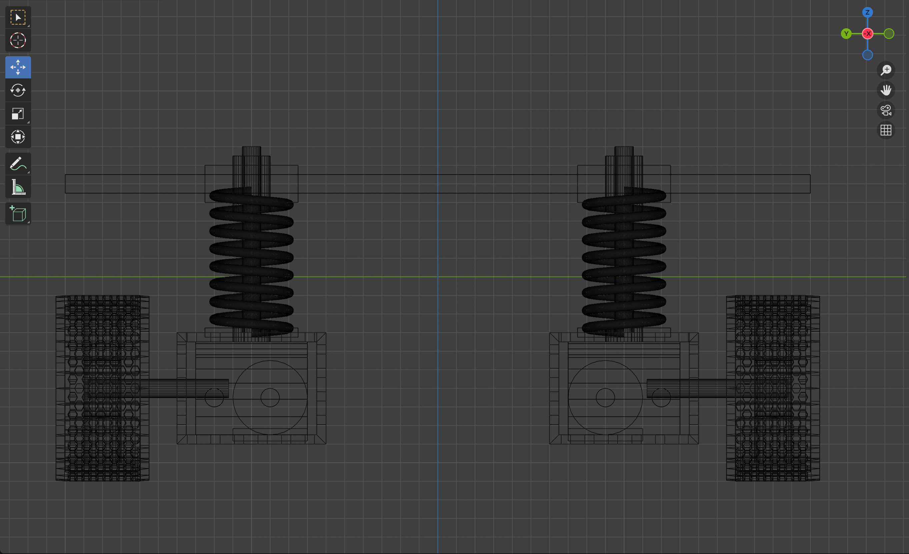
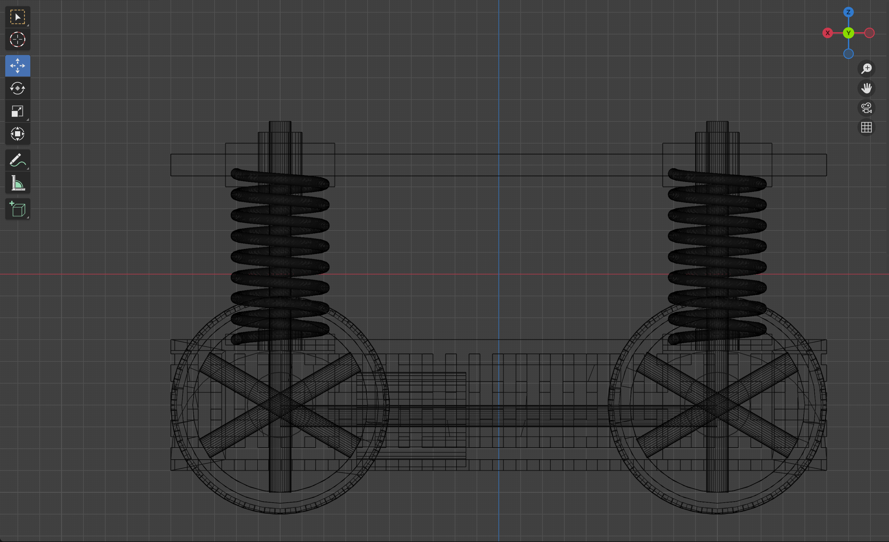
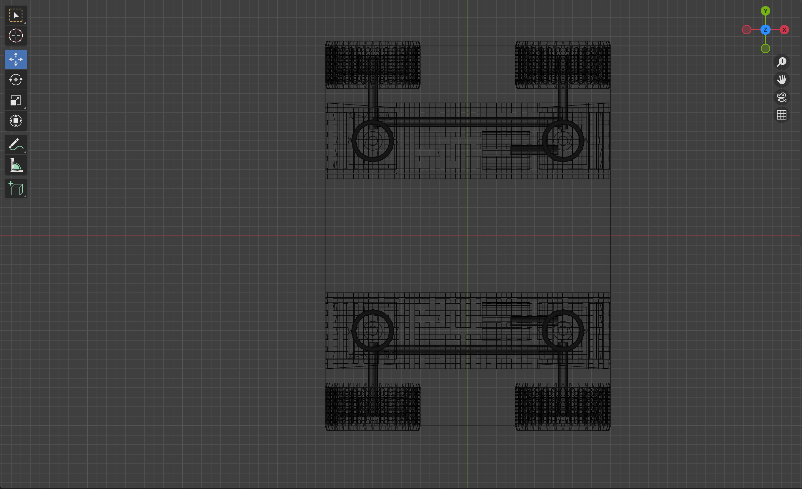
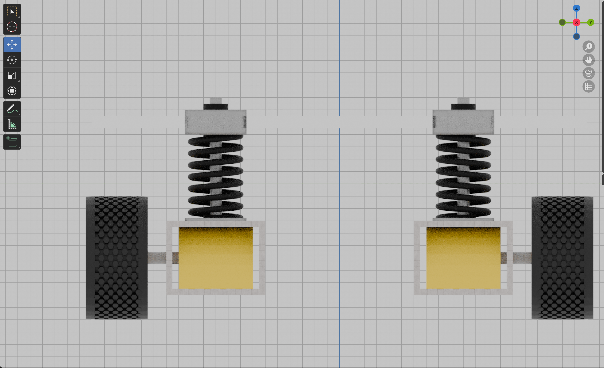
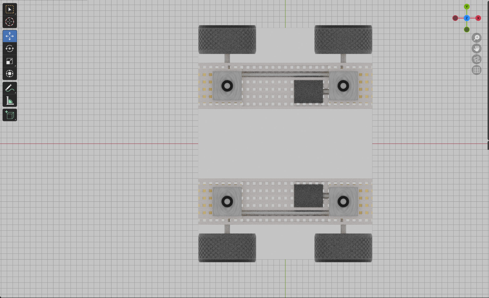
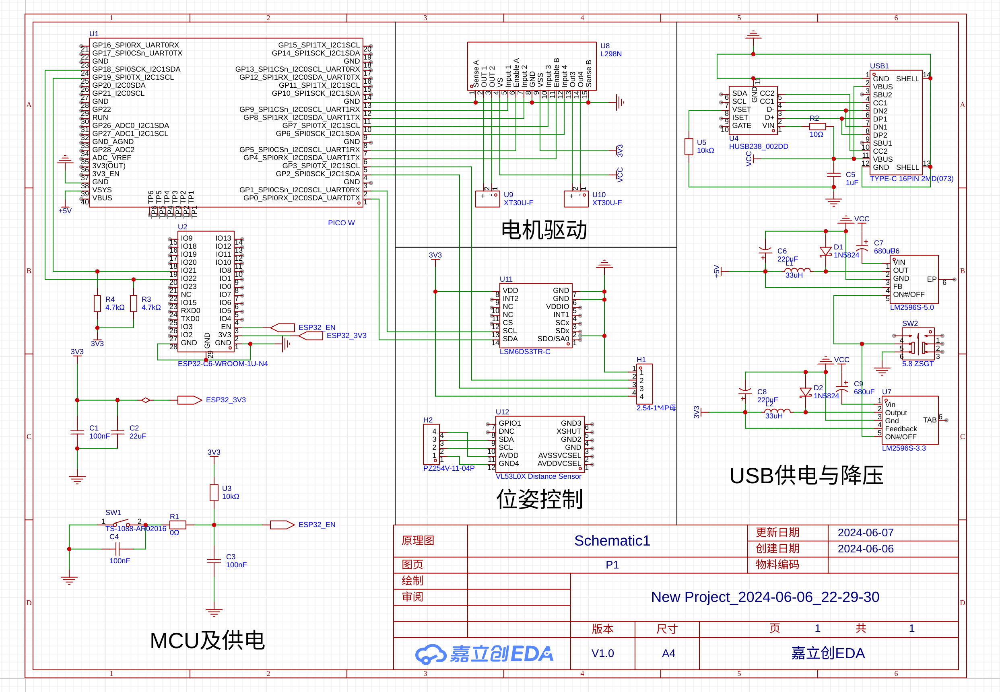
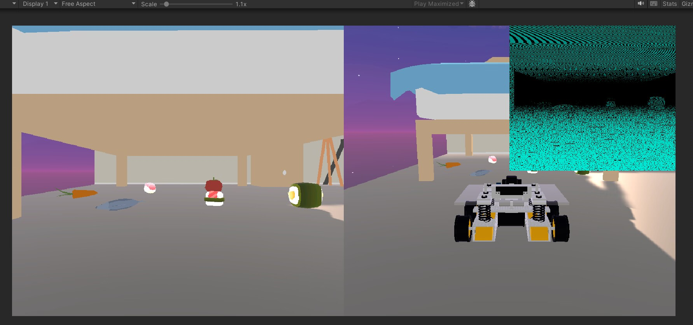

## 摘要

本项目设计了一种智能拾取小车。该车辆使用四轮驱动，搭配弹簧悬挂系统，可应对各种复杂环境；该车辆搭载视觉成像与激光雷达系统，可以探测黑暗复杂环境的地形地貌与障碍物；该车辆搭载802.11ax与Bluetooth 5 LE通信系统，可实现实时图像传送与遥控操作；该车辆使用车规级21700动力锂电池，可为整车提供充足动力与超长续航；该车搭载Raspberry Pi 5作为高速MCU，可轻松应对各类高性能计算场景。

本项目使用Blender次世代渲染，可以计算逼真的视觉效果；使用Unity 3D进行动态仿真，可以模拟真实环境下的车辆运动。

## 绪论

### 课题概况

本课题为机器人学课程设计，设计了一种智能拾取小车，该车辆能够进入并探测狭窄区域，并通过车载装置与区域内可移动部件进行交互。该车辆适用于探测和搜索家庭或办公环境中的大型家具下方等黑暗狭窄的区域，搜寻其中的高价值物品，并将其带出。该车辆搭载视觉成像与激光雷达，并可实现实时图像传送与遥控操作。

我们使用了多种计算机工具对此车辆进行设计与仿真。

### 课题背景和意义

#### 课题背景

在日常的工作和生活中，人们经常会遇到一些狭窄区域，例如家庭或办公环境中的大型家具下方等黑暗狭窄的区域。这些区域通常难以进入，也难以探测。在很多高价值物品或危险物品掉落其中后，人们往往无法轻易取回，动辄需要挪动沉重的家具或昂贵的设备，造成诸多不便。

此外，黑暗阴冷的角落中往往会成为滋生危险生物的温床，这些生物不仅容易携带病菌和有害物质，对人们的生理健康产生重大威胁；床底不时传来的窸窣声，还会在每一个无梦的夜晚生长为人们心中的无法言表的恐惧。久而久之，对生活在其中的人类造成巨大的精神压力。

此外，在刚刚结束的计算机图形学课程中，我们深刻的理解了老师强调的计算机图形学在虚拟现实、仿真可视化等领域的重要作用。我们亟待一个项目来检验我们在计算机图形学课程中学到的系统的理论知识，将其付诸实践。

#### 课题意义

+ 探测狭窄区域，拾取高价值物品
+ 与危险生物战斗，维护人类尊严
+ 精进电子游戏制作技术，感悟学科交叉魅力

### 研究和应用现状

目前，国内外智能机器人的教育应用正在蓬勃发展，世界上涌现出大量以教育为目的的智能机器人组件与比赛赛事，这也大大丰富了智能机器人的部件选型，降低了智能机器人的研发门槛。

更进一步的说，目前诸多相关智能机器人赛事，都有将虚拟现实技术与实际赛事相融合的趋势，许多团队亦使用仿真系统预构建和测试机器人系统的设计。这种应用趋势不仅降低了机器人系统的研发成本，能更直观的展示智能机器人系统的设计和应用过程，并将其投入到科普宣传工作之中，大大增加了观赏性和普适性。

## 系统设计方案和理论分析

### 系统设计总论

本系统由以下几个部分组成：结构支撑系统、动力推进系统、智能控制系统、电气供能系统、虚拟仿真系统。

系统整体设计过程中，遵循先机械后电气，先静止后运动，先计算后实践，极限载荷工况冗余的设计原则。

系统设计过程中采用敏捷开发的方法，通过迭代优化系统设计，在迭代中发现问题，修正问题，不断提高系统的稳定性和可靠性。

以下是各子系统设计分论。

### 结构支撑系统

结构支撑系统主要由铝合金和亚克力板材构成，在充分降低重量的情况下，尽可能多的复用工业中已有的标准件，降低制造成本。

该系统使用亚克力板材作为上层系统的支撑平面，采用铝合金作为动力舱及悬挂系统水平约束杆，足以负载整车质量，维持车体结构。

系统采用下沉式动力舱，动力舱内设有电机与齿轮箱，降低整车重心，提高车体稳定性。动力舱与上层平面通过弹簧悬挂系统连接，可以有效降低车体震动，维持上层平面平稳。

弹簧的力学分析，在其弹性限度内可简单的使用Hooke定律进行分析：

$$ \sigma = E \epsilon $$

考虑系统阻尼，弹簧-质量-阻尼器系统的微分方程为：

$$ m \frac{\mathrm{d}^2 x}{\mathrm{d} t^2} + f \frac{\mathrm{d} x}{\mathrm{d} t} + k x = F $$

拉普拉斯变换后得到系统传递函数为：

$$ \frac{X(s)}{F(s)} = \frac{1}{m s^2 + f s + k} $$

考虑到系统在垂直方面受力多为冲激函数，计算其对冲激函数的响应得到：

$$ X(s) = \frac{1}{m s^2 + f s + k} $$

<figure>
    <div style="display: grid; grid-template-columns: repeat(3, 1fr); text-align: center;">
        <div>
            
            <p>正视图</p>
        </div>
        <div>
            
            <p>侧视图</p>
        </div>
        <div>
            
            <p>顶视图</p>
        </div>
    </div>
    <figcaption>结构支撑系统线框图</figcaption>
</figure>

<figure>
    <div style="display: grid; grid-template-columns: repeat(3, 1fr); text-align: center;">
        <div>
            
            <p>正视图</p>
        </div>
        <div>
            
            <p>侧视图</p>
        </div>
        <div>
            
            <p>顶视图</p>
        </div>
    </div>
    <figcaption>结构支撑系统效果图</figcaption>
</figure>

### 动力推进系统

动力推进系统由两个驱动轮和两个无驱动轮组成，轮胎采用塑料材质轮毂和橡胶材质轮胎。

动力部分使用Falcon 500无刷电机，使用12V电压，额定功率400W，重500g，峰值功率780W，峰值转速3190RPM，峰值效率87%。可以为机器人提供强劲动力。

前后轮之间通过传动杆连接，稳定可靠，保证车辆在单侧轮失去操纵时仍能驶出险境。

轮胎部分采用块状越野花纹，可以大幅度提高车的操纵及制动性能，增强车在泥泞，积水，雪地等复杂路况下的通过能力。

对于动力推进系统建模如下：

$$
\begin{cases}
  F(t) = \frac{P(t)}{v(t)}, \\\
  \mathrm{d} v = a \mathrm{d} t, \\\
  a(t) = \frac{F(t) - f(t)}{m,} \\\
  f(t) = C_0 + C_1 v(t) + C_2 v(t)^2
\end{cases}
$$

其中阻力 $f(t)$ 为高阶多项式，其零次项主要来源于摩擦力，一次项主要来源于轮胎行驶过程中的非理想形变与滑动，二次项主要来源于车辆甚低速行驶下的空气阻力。

对于这样的模型，我们使用强大的CAS求解系统Wolfram Alpha求解如下：

<div align="center">
[媒体已移除]
</div>

由此可见，该系统不存在初等解析解，因此仅适用于仿真场景下的差分数值计算，而无法应用理论分析。

在比甚低速更低速的场景下，我们可以简化模型，去除阻力的高阶项，认为车辆所受阻力主要由摩擦力提供，简化后的模型如下：

$$
\begin{cases}
  F(t) = \frac{P(t)}{v(t)}, \\\
  \mathrm{d} v = a \mathrm{d} t, \\\
  a(t) = \frac{F(t) - f(t)}{m,} \\\
  f(t) = C_0
\end{cases}
$$

对其应用CAS求解器后得到：

<div align="center">
[媒体已移除]
</div>

需注意：该方程在

$$
\begin{cases}
  v(t) = 0, \\\
  P \neq 0,
\end{cases}
$$

时，发动机的输出扭矩为无穷大，产生奇异解。在实际应用中，由于发动机的非线性因素，传动系统的惯性，材料的杨氏模量等因素，无法达到理想状态下加速度无限大的情况，因此在后续仿真模拟中需对发动机扭矩和加速度的取值范围进行限制。

*对该部分模型的仿真与进一步的分析，交由我的组员完成。*

### 智能控制系统

智能控制系统使用Raspberry Pi 5作为高速通用控制MCU，提供25GFlOPs的浮点计算能力，搭载基于Linux的函数式操作系统NixOS，快速可复现的完成计算任务的部署，轻松应对各类复杂挑战。

该系统使用ESP32 C6作为通信系统MCU，搭载802.11ax与Bluetooth 5 LE通信系统，提供最大65MHz的通信速率，可实现实时高清图像传送与低延迟低功耗远程控制操作。

系统使用LM2596S降压模块，将电池组输出的20V电压降压为5V和3.3V，为低压设备提供稳定安全的工作电压。

车身搭载摄像头、激光雷达，可探测周围复杂环境。摄像头可选用拆除红外滤光片的CMOS成像模组，进一步增强其在黑暗环境下的成像能力。

车身搭载激光测距模块，作为紧急避障的最后一道防线，可在摄像头和激光雷达受到干扰，用户误操作，系统故障等极端场景下迅速反应，刹停车辆，保护用户的生命财产安全。

车身搭载LSM6DSL三轴加速度计陀螺仪，用于实时测算车身加速度与角加速度，对车辆速度和位置进行闭环控制。

<figure>
    <div style="text-align: center;">
        
    </div>
    <figcaption>智能控制系统原理图</figcaption>
</figure>


<div align="center">
[媒体已移除]
</div>

*对于车身姿态的智能控制算法，交由我的组员完成。*

### 电气供能系统

电气供能系统使用8节21700锂电池组，使用国产新能源汽车同款的车规级亿纬锂能50E电芯，单节容量5000mAH。整套电池系统容量87Wh，输出电压20V，可为整车提供长时续航与峰值性能。

锂电池组设计的常规工况稳定输出功率为100W。Raspberry Pi 5在极限负载下需要最高15W的核心供电，MCU，通信系统，传感器的供电设计总裕度为25W，降压模块的转换效率为80%，因此总体智能控制系统供电设计的裕度为30W，剩余70W功耗将全部分配给电机，预计可使车辆最大行进速度超过 10m/s。

在常规工况下，车辆续航时长约为50分钟。

锂电池组的短时输出峰值功率可高达210W，可供车辆在紧急情况下用于战术动作规避，高速逃离敌人追击等。

此外，在不需要严格控制车体体积与质量的应用场景下，还可为亚克力材质的上层平面加装铝合金承重梁，并将电池组替换为12V铅酸蓄电池，彻底释放动力推进系统潜能的同时提供更长时间的续航。

### 虚拟仿真系统

虚拟仿真系统使用Blender建模。Blender是一个开源的三维计算机图形软件，支持多种操作系统，可以用于建模、动画、渲染、视频编辑等多种用途。

Blender内置了Cycles渲染引擎，可以计算逼真的光线追踪效果，可以模拟真实世界中的光线传播、反射、折射等物理现象。

Unity 3D是一个跨平台的游戏引擎，可以用于开发2D和3D游戏，也可以用于开发虚拟现实和增强现实应用。Unity 3D内置的物理引擎可以模拟真实世界中车辆在复杂环境中的运动。

Unity 3D的可编程渲染管线可以实现高度自定义的着色器和渲染过程，可以实现激光雷达的视觉模拟。

虚拟仿真系统使用Microsoft Xbox Elite 2无线控制器，能够提供高度可定制的操控体验，可以实现与真实环境下完全一致的操控体验。

## 机器人实验与结果分析

### 次世代渲染

#### 环境描述

```
OS: NixOS 24.11.20240622.a71e967 (Vicuna) x86_64
Kernel: 6.9.6-zen1
CPU: AMD Ryzen 7 7840U w/ Radeon 780M Graphics (16) \@ 5.1GHz
Memory: 54.73 GiB
GPU: AMD ATI Phoenix1 / NVIDIA GeForce GTX 3080 Ti
Blender: 4.1.1
OpenGL version string: 4.6 (Compatibility Profile) Mesa 24.1.1
```

#### 实验内容介绍

使用Blender内置的Cycles渲染引擎，进行基于光线追踪的离线物理渲染，模拟真实的光线效果，达到以假乱真的效果。使用NVIDIA GeForce GTX 3080 Ti进行CUDA硬件加速，加快渲染速度。

#### 实验结果


如有雷同，也不是巧合。如果您在隔壁班看到一个下棋机器人的组做了画风一模一样的次世代渲染，那是因为他们组也是我帮忙做的。

### 动态仿真

*场景建模，运动控制等部分交由我的组员完成。*

#### 激光雷达仿真

#### 环境描述

```
…………
Unity 3D: 2022.3
JetBrains Rider: 2024.1.3
```

#### 实验内容介绍

通过在Unity 3D中修改渲染管线，增加深度信息，编写着色器，最终在Unity 3D的游戏画面中实现激光雷达的效果。

激光雷达的特点是分辨率角恒定，即距离较近的物体分辨率更高，点云更密集；距离较远的物体分辨率更低，点云更稀疏，且成线性关系。因此，在计算机图形学的渲染过程中，根据片元的深度信息，对其进行栅格化和重采样，并随机丢弃一部分片元数据，即可得到类似激光雷达扫描结果的点云数据。随后，再根据自己的喜好将这些点云重新着色，即可得到可视化的模拟激光雷达。

```cs
Shader "Custom/Depth_Shader"
{
    Properties
	{
		_MainTex ("Texture", 2D) = "white" {}
		_Color ("Color", Color) = (1.0, 1.0, 1.0, 1.0)
	}
	SubShader
	{
		Tags { "RenderType"="Opaque" }
		LOD 100

		Pass
		{
			CGPROGRAM
			#pragma vertex vert
			#pragma fragment frag
			
			#include "UnityCG.cginc"

			struct appdata
			{
				float4 vertex : POSITION;
				float2 uv : TEXCOORD0;
			};

			struct v2f
			{
				float2 uv : TEXCOORD0;
				float4 vertex : SV_POSITION;
			};

			sampler2D _MainTex;
			sampler2D _CameraDepthTexture;
			float4 _MainTex_ST;

			float random (float2 uv)
            {
                return frac(sin(dot(uv,float2(12.9898,78.233)))*43758.5453123);
            }
			
			v2f vert (appdata v)
			{
				v2f o;
				o.vertex = UnityObjectToClipPos(v.vertex);
				o.uv = TRANSFORM_TEX(v.uv, _MainTex);
				return o;
			}

			float4 _Color;
			
			fixed4 frag (v2f i) : SV_Target
			{
				float depth = UNITY_SAMPLE_DEPTH(tex2D(_CameraDepthTexture, i.uv));
				float linear01Depth = Linear01Depth(depth)/0.5;
				if (depth>0.4) linear01Depth = Linear01Depth(0.4);
				if (random(i.uv*depth*_Time[0]) > linear01Depth) {
					return (1 - linear01Depth)*_Color;
				} else {
					return 0;
				}
			}

			ENDCG
		}
	}
}
```

#### 实验结果



## 结论

我要做的第一个反思是，答辩的时候老师批评我说这辆车动力舱过低，影响车辆的越障能力。我觉得这个批评很有道理。最开始的动力舱设计是出于简化传动系统，降低车辆底盘的目的考虑的，只有整车高度足够低，车辆才有进入低矮空间的机会。倘若把底盘做高，固然会提升车辆的越障能力和涉水性能，但是如果连空间都进不去了，越障性能再高又有什么意义呢。现在想来，我们应该将车辆模块化设计，在保持现有主体结构不变的情况下，提供多种直径的轮胎供用户选择，让用户根据自己的使用场景来装配不同的适宜的轮胎。

我要做的第二个反思是，车辆在黑暗条件下的观测能力实际是不足的。激光雷达毕竟不能代替视觉，在实际应用过程中一旦遇到低反射率的物体，就会大幅度提高控制者分辨的难度；即使物体反射率足够高，通过轮廓也可能很难看出物体是什么。我们固然提出了拆除摄像机的红外滤光片来增强红外波段的吸收，大幅度提高了对于活动热源的探测能力，但是仍旧无法解决黑暗环境下红外源也相当有限的问题。要解决这个问题，最好的办法是在车身上增加一个大号的手电筒。譬如XLamp的XHP 70.2 LED，最大功耗为28.8W，光通量为1500流明，足以适应绝大部分家庭和工作场合。

我们还可以做的改进也有很多，只是囿于时间所限，我们并没有把这个课程设计完全做到极致，省略了许多非核心的步骤。

首先，对于绪论部分提到的与床底下无声的危险生物搏斗这个想法，最早只是我的一腔热血，和随口一提的做一个开放世界第一人称射击游戏。可是随心所欲挖下的一个坑就要在后面挖越来越多的坑来填补，很快我们就在具体设计的时候遇到了各种各样的问题。这辆车能够应对什么样的假想敌？是蚊子，还是蟑螂，还是老鼠，甚至是凭借车身自重和极限速度与伤人的中小型猎犬同归于尽？我们应该携带什么样的武器，锐器，还是激光武器，还是实弹射击？这些设计会不会触犯所在国家地区的法律法规，会不会引起动物保护组织的游行抗议，是否符合动物伦理学？最终，这个最初的想法也只能被暂时搁置，成为文字上的一个美好希望。

在结构支撑系统部分，我们没有对模型进行静态受力与动态受力的仿真分析。固然，从经验上来看，这辆车的结构设计是一定完全超出了车辆实际所需的，但是空口无凭，实践终归才是检验真理的唯一标准。进行静态受力分析也有助于我们下一步向着轻量化的方向迈进，使用更轻量的结构件代替标准件，降低车身重量。

在动力推进系统部分，我们没有认真分析车辆的阻力来源，而是简单的用低次多项式代替了复杂的模型。在这一方面，我们还可以深入学习电机学课程，广泛阅读文献，继续细化动力推进系统的数学模型。

在电气供能系统部分，我们没有自行设计锂电池组的控制电路，而是直接选择了市面上价格高昂的成品系统，使用Type-C E-Maker为整车提供主供电的设计实在是过于灵车，成品方案的稳定和峰值输出功率也远不能有效发挥出这辆车的功能上限。

在虚拟仿真系统部分，包含的问题就更多了。我们完全没有时间做一个真正的不管是蟑螂还是老鼠的关底BOSS来给玩家体验，只能安排小车去捡拾一点床底下的垃圾，到处跑跑玩玩。我们还应该在屏幕上增加OSD叠加层，实时显示当前的目标速度和实际速度的控制曲线，以展示利用加速度计和陀螺仪累计计算车辆的姿态，以及闭环控制算法的实际效果。在渲染管线中，我们没有使用光线追踪模型和高清渲染管线，导致游戏的视频画面效果远不及次世代渲染的效果图。

以上这些问题最终导致了整个车辆设计几乎全部源自于我高中时期的个人经验，而甚至连一篇参考文献都写不出来。我们当然可以把《机器人学》《自动控制原理》乃至《C语言21天从入门到精通》全都写上去，然而这样又有什么意义呢。这篇报告终归只是一点纸上谈兵的我个人的自娱自乐，而不能成为一篇名垂青史流传千古的学术著作，又何必沐猴而冠。倘若这里不得不有些参考文献的话，请允许我交由我的组员完成吧。

## 附录

### 参考文献

无

### 致谢

首先，我要感谢《机器人学》课程的陈白帆老师，您一学期的授业之恩无以为报，仅以此拙作作为纪念。

我要感谢我的所有组员，帮助我共同完成了这一个课程设计。在这个课程设计中，她们每一个人都是至关重要，不可或缺的。

然后，我要感谢在人工智能专业开设图形学和游戏课程的李仪老师，让我在繁杂枯燥的控制理论中看到了一抹亮色。

感谢非营利组织 *For Inspiration and Recognition of Science and Technology* ：我曾在2017年侥幸获得了FIRST科技挑战赛中国区的晋级资格，有幸代表中国参加世界锦标赛；永远深切怀念在2019年带我参加RCC钱江国际机器人公开赛的7524队队长。这些早应被忘却的记忆竟能在7年后再一次眷顾我，让我迟钝地回想起这些完成这次课设所用的技能。

最后，我要感谢我在这次课程设计中使用过的所有开源软件的维护者，一位开源软件维护者向你们所有人致意。
